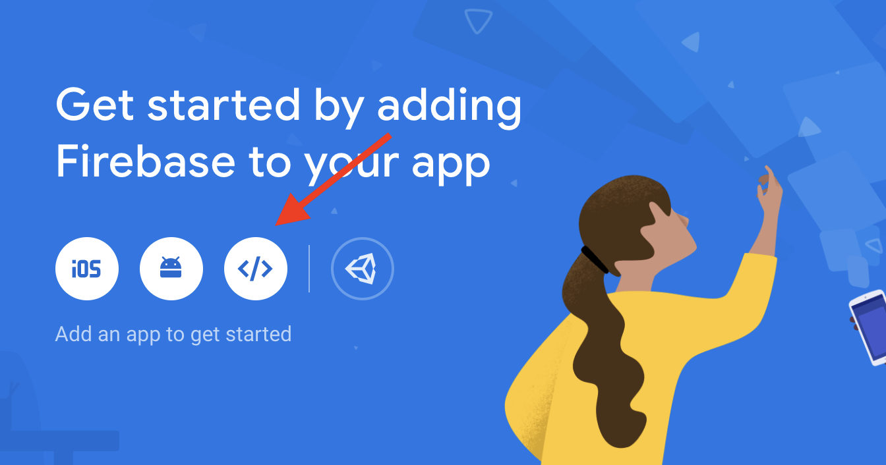
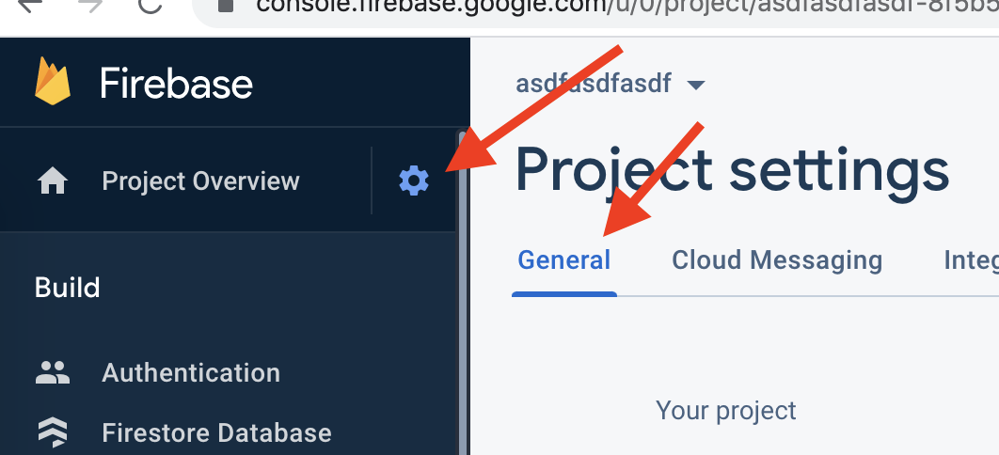

# Text to Speech
Creates buttons based on input text, for each sentence and word!
It translates it to Russian and plays it with text to speech!


# Installation
1. clone the repo/download
2. replace apikey for translation with yours (get it at console.cloud.google.com)
3. create database at console.firebase.google.com
4. go to firebase
go to (and login): https://console.firebase.google.com/u/0/project/_/overview
5. add new project & continue
6. click on web app symbol

7. register app
8. copy this
var firebaseConfig = {
    apiKey: "*********",
    authDomain: "*********",
    projectId: "*********",
    storageBucket: "*********",
    messagingSenderId: "*********",
    appId: "*********",
    measurementId: "*********"
  };
9. copy this to src/environments/environment.ts (create this file if it doesn't exist)
```
export const environment = {
  production: true,
  firebase: {
    apiKey: "*********", // YOUR CREDENTIALS HERE
    authDomain: "*********",
    projectId: "*********",
    storageBucket: "*********",
    messagingSenderId: "*********",
    appId: "*********",
    measurementId: "*********"
  }
}
```  
10. export also whitelisted emails in src/environments/environment.ts   
```
export const whitelistedEmails = [ ... emails here seperated by comma ... ]
```  
11. only these whitelisted emails will get access to your app!
12. npm install
13. npm start

# Using an existing project
4. go to firebase
go to (and login): https://console.firebase.google.com/u/0/project/_/overview
5. select the project
6. click project settings

7. scroll down on the first general page
8. you'll find the credentials:
```
{
    apiKey: "*********", // YOUR CREDENTIALS HERE
    authDomain: "*********",
    projectId: "*********",
    storageBucket: "*********",
    messagingSenderId: "*********",
    appId: "*********",
    measurementId: "*********"
  }
  ```
