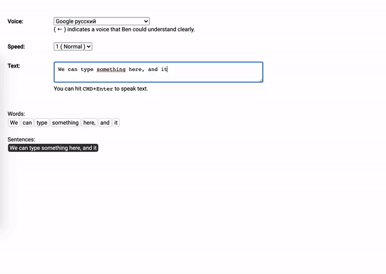

# Text to Speech
Creates buttons based on input text, for each sentence and word!
It translates it to Russian and plays it with text to speech!

# Installation
1. clone the repo/download
2. replace apikey for translation with yours (get it at console.cloud.google.com)
3. npm install
4. npm start
